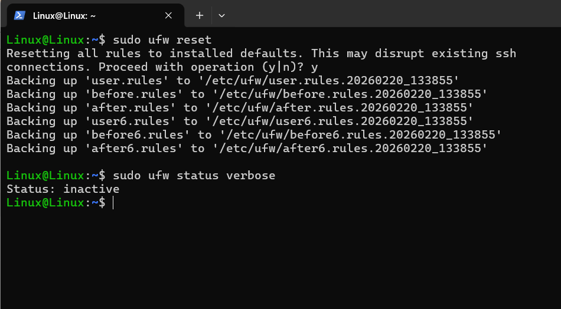
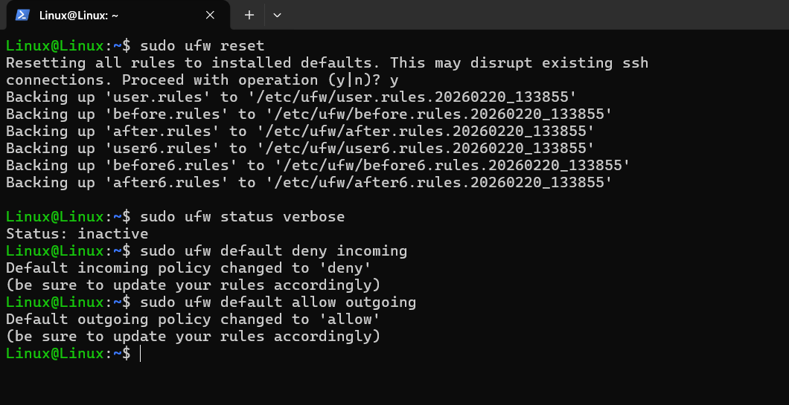
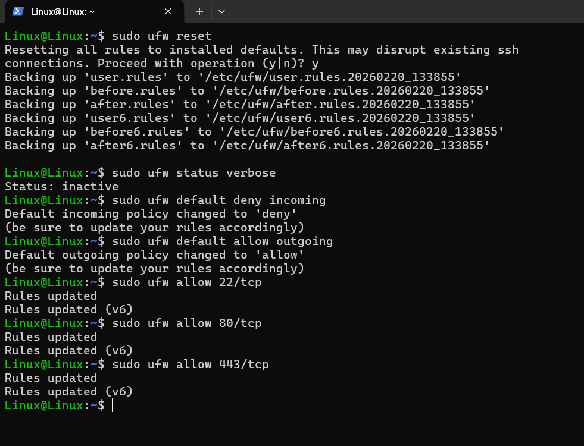
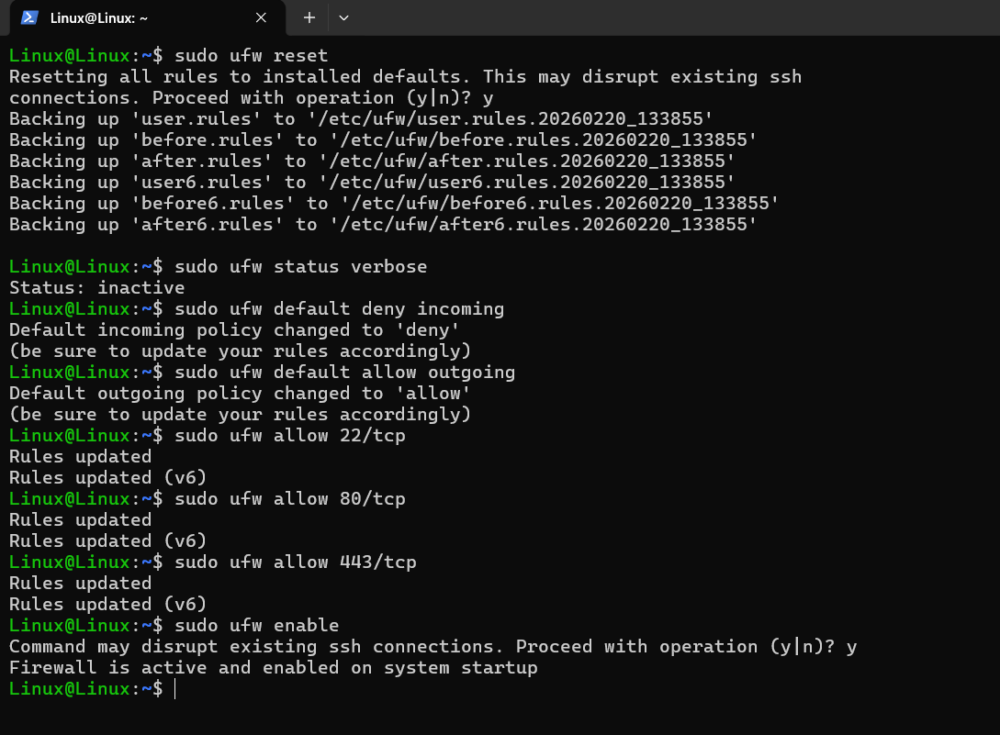
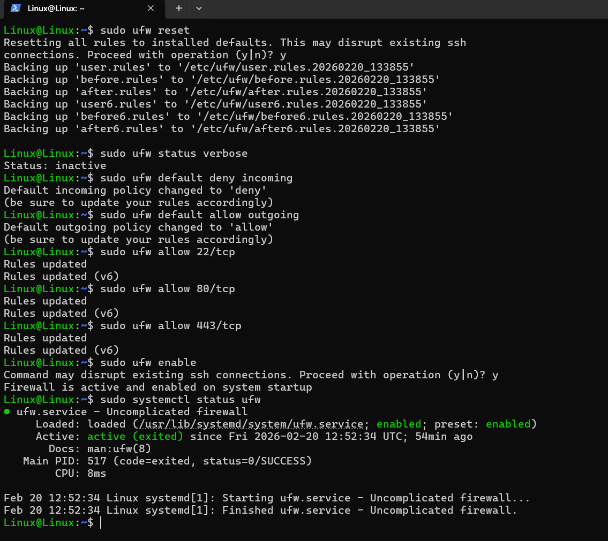
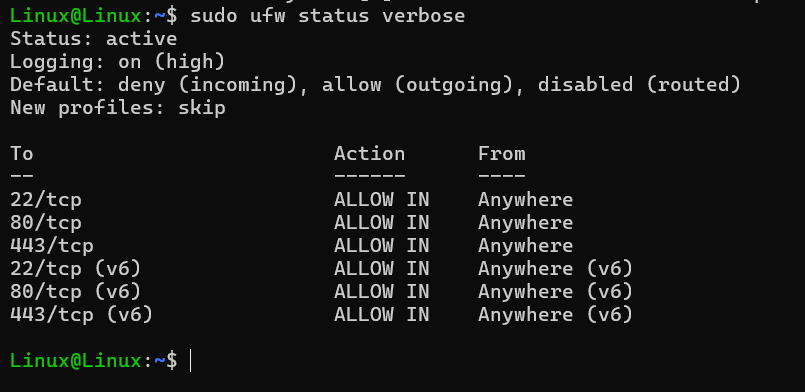
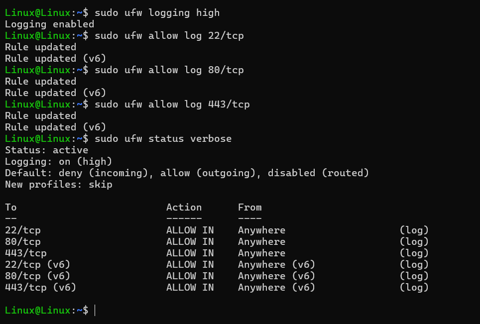
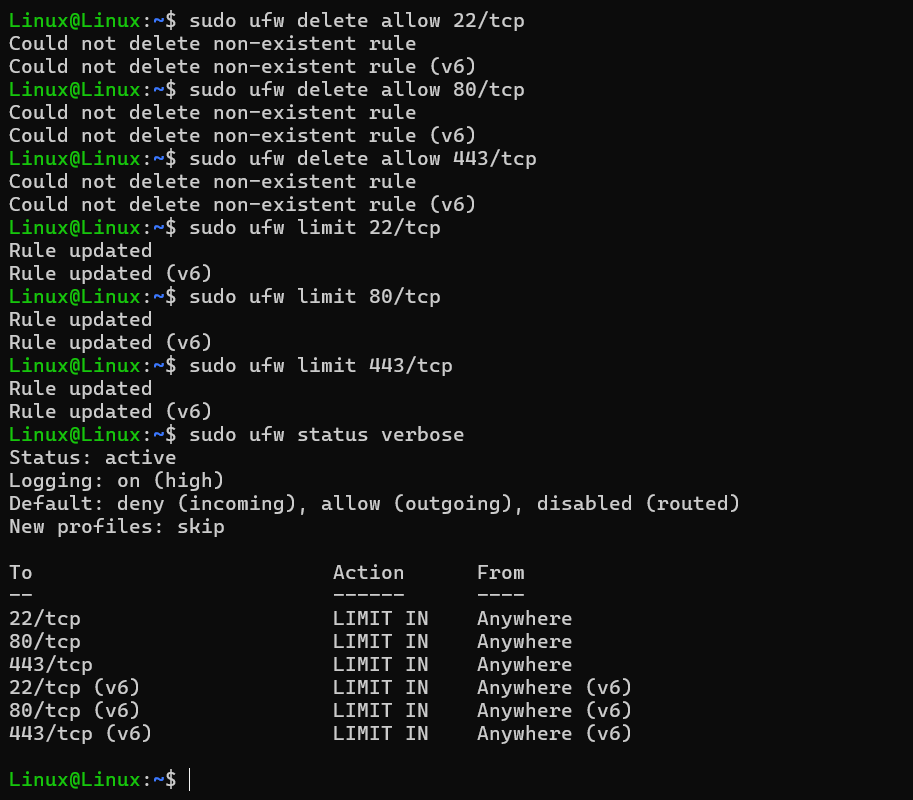
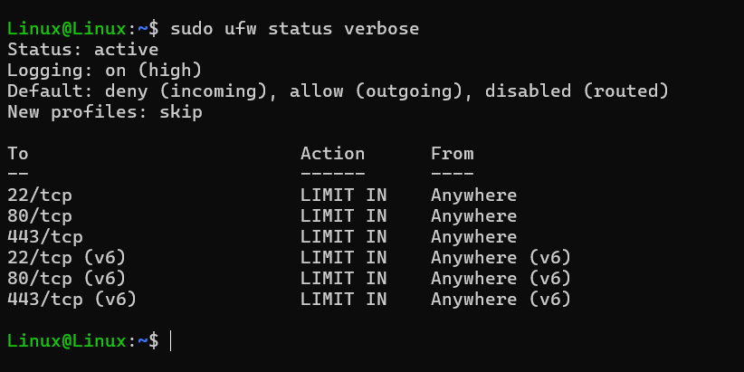

Overview

This task will use firewall to protect the server, and also configure the firewall for OpenSSH Server, HTTP and HTTPS Server.

Install the ufw package and clean the configuration.

First, I downloaded and installed the ufw package using the apt command.
```bash
sudo apt update
sudo apt install ufw -y
```
After installation, I needed to wipe the configuration to ensure everything is working properly.
```bash
sudo ufw reset
sudo ufw status verbose
```

Define OpenSSH server, HTTP and HTTPS server for the firewall.

I set the firewall to block all incoming traffic and allow outgoing traffic.
```bash
sudo ufw default deny incoming
sudo ufw default allow outgoing
```
 
I only allowed incoming traffic for services of OpenSSH, HTTP, and HTTPS.
```bash
sudo ufw allow 22/tcp
sudo ufw allow 80/tcp
sudo ufw allow 443/tcp
```
 
After adding the services, I enabled the firewall.
```bash
sudo ufw enable
```
 
The firewall was also set to automatically start with the system. However, I double-checked it to be sure.
```bash
sudo systemctl status ufw
```
 
The firewall displayed the current configuration.
```bash
sudo ufw status verbose
```
 
Define the firewall so that all connections blocked by the firewall are logged. And define a log for all known and allowed services.

I executed following commands to enable its logging function.
```bash
sudo ufw logging high
sudo ufw allow log 22/tcp
sudo ufw allow log 80/tcp
sudo ufw allow log 443/tcp
sudo ufw status verbose
```

Logging was enabled, and ufw logs are stored in /var/log/ufw.log

Prevent SYN flood-type attacks.

First, I had to delete the existing rules.
```bash
sudo ufw delete allow 22/tcp
sudo ufw delete allow 80/tcp
sudo ufw delete allow 443/tcp
```
Then added new rules with rate limiting.
```bash
sudo ufw limit 22/tcp
sudo ufw limit 80/tcp
sudo ufw limit 443/tcp
```
I checked the new configuration.
```bash
sudo ufw status verbose
```

This limits the number of connections to the server within a time period, helping to protect the server from SYN flood and brute force attacks.

Prevent Port Scanning.

I have defaulted to denying all incoming requests to unknown ports.
```bash
sudo ufw default deny incoming
```
I set only known services could be accessible, and enabled logging to detect port scanning attempts.
```bash
sudo ufw logging high
sudo ufw allow log 22/tcp
sudo ufw allow log 80/tcp
sudo ufw allow log 443/tcp
```

